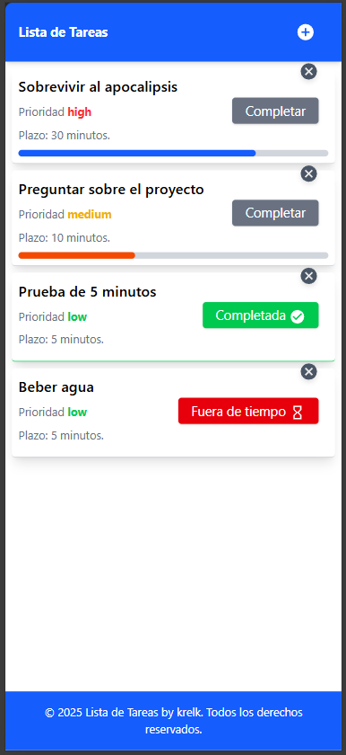

# Todo List App

To-do list enfocada en **deadlines** y **prioridades** para mantener el foco.
Autodetección de idioma (ES/EN).

## Preview
<p align="center">
  
</p>

## Features
- Tareas con deadline ⏳
- Prioridades (Alta/Media/Baja)
- Traducción automática (ES/EN)

## Stack
React + TypeScript + Vite + Tailwind

## Dev
```bash
npm i
npm run dev
```

## Android APK
```bash
npm i @capacitor/core @capacitor/cli
npx cap init TODO-APP com.tuempresa.todo
npm run build
npx cap add android
npx cap copy
npx cap open android
```